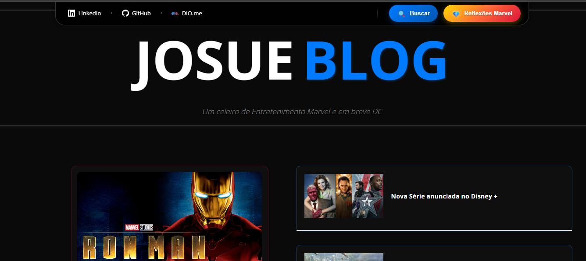
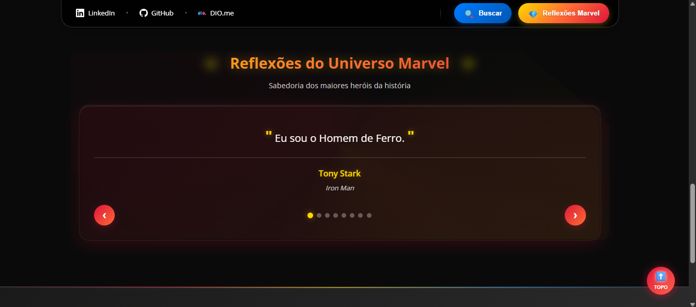
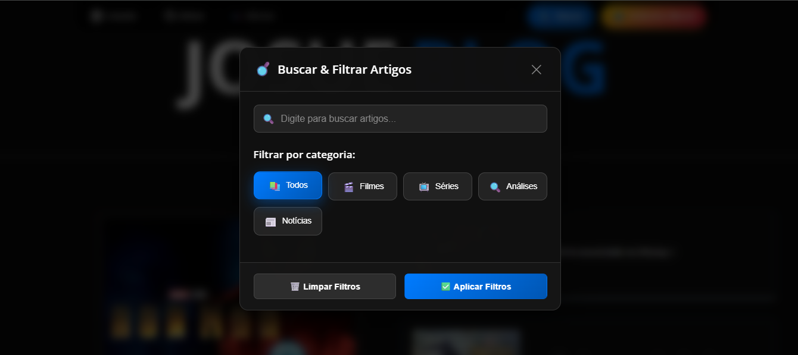
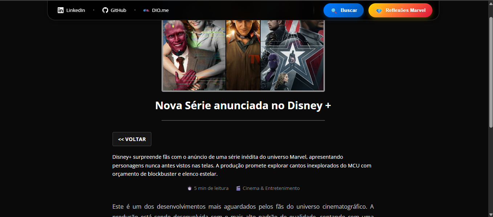

# 🎬 Angular Blog - Um Celeiro de Entretenimento Marvel 

[](https://angular.dev/)
[
- 🚀 [Guia de Commits](./COMMIT-GUIDE.md)
- 📊 [Changelog Commit #9](./CHANGELOG-COMMIT-9.md)
- 🖼️ [Screenshots do Projeto](./public/images/screenshots/)
- 🎨 [Style Guide](./STYLE-GUIDE.md)
- 📱 [Responsive Design](./RESPONSIVE-GUIDE.md)t-5.8.2-blue)](https://www.typescriptlang.org/)
[](https://www.dio.me/)
[](https://www.marvel.com/)

Este é um projeto de blog desenvolvido em Angular como parte da **Formação Angular Developer** da [DIO.me](https://www.dio.me/), transformado em uma experiência imersiva do Universo Marvel com funcionalidades avançadas de busca, filtros e interatividade.

**Projeto gerado com:** [Angular CLI](https://github.com/angular/angular-cli) versão 20.0.5

## 🚀 Demonstração

### 📸 **Screenshots do Projeto**

<div align="center">


*Página inicial com layout responsivo, efeitos Marvel e navegação fixa*


*Modal de busca e filtros com efeito glassmorphism*


*Seção interativa de citações do Universo Marvel*


*Layout responsivo funcionando perfeitamente em dispositivos móveis*


*Página individual de artigo com navegação e design Marvel*

</div>

## ✨ Funcionalidades Avançadas

### 🔍 Sistema de Busca e Filtros (Commit #9)
- **Modal de busca** com efeito glassmorphism
- **Filtros por categoria** (Filmes, Séries, HQs, Jogos, Teorias)
- **Busca em tempo real** por título e conteúdo
- **Interface responsiva** e intuitiva

### 🎨 Experiência Marvel
- **Efeitos neon** inspirados no universo Marvel
- **Cores temáticas** (Iron Man, Captain America, Infinity Stones)
- **Citações interativas** de personagens Marvel
- **Navegação com efeitos visuais** modernos

### 📱 Interface Moderna
- **Barra de navegação fixa** com backdrop blur
- **Sistema de paginação** (10 artigos por página)
- **Back-to-top** com animação de foguete
- **Ícones de redes sociais** integrados
- **Layout responsivo** side-by-side

### 🔥 **Destaques Visuais**
- ✨ **Glassmorphism**: Modal de busca com efeito de vidro translúcido
- 🎯 **Marvel Neon Effects**: Cards com brilho inspirado nos heróis
- 🚀 **Micro-interactions**: Hover effects e transições suaves
- 📱 **Mobile-First**: Design totalmente responsivo
- 🎨 **Visual Consistency**: Identidade visual coesa em todo projeto

## 🛠️ Arquitetura Técnica

### **Stack Principal**
- **Angular 20.0.0** - Framework com Standalone Components
- **TypeScript 5.8.2** - Type-safe development
- **RxJS** - Reactive programming com BehaviorSubject
- **CSS3 + Animations** - Efeitos visuais avançados
- **SVG Icons** - Gráficos escaláveis

### **Padrões e Práticas**
- **Service-based state management** (SearchService)
- **Component composition** reutilizável
- **Reactive forms** e observables
- **Mobile-first design** responsivo
- **SEO optimization** com SSR

## 📁 Estrutura do Projeto

```
src/
├── app/
│   ├── components/              # Componentes reutilizáveis
│   │   ├── big-card/           # Card principal de artigos
│   │   ├── small-card/         # Cards secundários
│   │   ├── menu-title/         # Cabeçalho do blog
│   │   ├── menu-bar/           # Navegação fixa com social links
│   │   ├── search-modal/       # Modal de busca e filtros
│   │   ├── marvel-quotes/      # Citações do universo Marvel
│   │   └── back-to-top/        # Botão voltar ao topo
│   ├── pages/                  # Páginas da aplicação
│   │   ├── home/               # Página inicial com paginação
│   │   └── content/            # Artigo individual
│   ├── services/               # Serviços e estado global
│   │   └── search.service.ts   # Gerenciamento do modal de busca
│   ├── data/                   # Dados e interfaces
│   │   ├── dataFake.ts         # Mock de artigos Marvel
│   │   └── article.interface.ts # Interface TypeScript
│   └── assets/                 # Recursos estáticos
│       └── images/
│           ├── social/         # Ícones SVG das redes sociais
│           └── screenshots/    # Capturas de tela do projeto
```

## 🚀 Como Executar o Projeto

### 📋 Pré-requisitos
- **Node.js** 18.x ou superior
- **npm** 9.x ou superior
- **Angular CLI** 20.x

### 🛠️ Instalação e Execução
```bash
# 1. Clone o repositório
git clone [url-do-repositorio]
cd angular-blog

# 2. Instale as dependências
npm install

# 3. Execute em modo desenvolvimento
npm start
# Acesse: http://localhost:4200

# 4. Build para produção
npm run build

# 5. Servir com SSR
npm run serve:ssr:angular-blog
```

### 🧪 Testes
```bash
# Testes unitários
npm test

# Testes E2E
ng e2e
```

## 🎯 Funcionalidades Implementadas

### ✅ Core Features
- [x] **Componentes reutilizáveis** (Big Card, Small Card, Menu)
- [x] **Roteamento dinâmico** com parâmetros
- [x] **Layout responsivo** mobile-first
- [x] **Navegação entre artigos** 

### ✅ Inovações Marvel (Commit #9)
- [x] **Sistema de busca e filtros** com modal glassmorphism
- [x] **Efeitos neon** temáticos do universo Marvel
- [x] **Barra de navegação fixa** com blur backdrop
- [x] **Citações interativas** de personagens Marvel
- [x] **Sistema de paginação** (10 artigos por página)
- [x] **Back-to-top** com animação de foguete
- [x] **Ícones de redes sociais** integrados
- [x] **Layout side-by-side** otimizado

## 📚 Conceitos e Aprendizados

### 🎯 Angular Avançado
- **Standalone Components** - Arquitetura moderna sem NgModules
- **Service-based State Management** - BehaviorSubject para estado global
- **Component Communication** - @Input, @Output, e injeção de serviços
- **Reactive Programming** - RxJS observables e operators
- **Server-Side Rendering** - Performance e SEO otimizados

### 🎨 Design & UX Moderno
- **Glassmorphism** - Efeito de vidro em modais
- **Neon Effects** - Animações CSS com box-shadow
- **Marvel Theming** - Paleta de cores inspirada nos heróis
- **Responsive Design** - Mobile-first com breakpoints
- **Micro-interactions** - Hover effects e transições

### ⚡ Performance & Boas Práticas
- **Lazy Loading** - Carregamento otimizado
- **OnPush Change Detection** - Performance melhorada
- **TypeScript Strict Mode** - Tipagem rigorosa
- **SEO Optimization** - Meta tags e SSR
- **Accessibility** - Semantic HTML e ARIA

## 🤝 Contribuindo

Este projeto é educacional, mas contribuições são bem-vindas:

1. **Fork** o repositório
2. **Crie** uma branch: `git checkout -b feature/nova-funcionalidade`
3. **Commit** suas mudanças: `git commit -m 'feat: adiciona nova funcionalidade'`
4. **Push** para a branch: `git push origin feature/nova-funcionalidade`
5. **Abra** um Pull Request

## � Documentação Adicional

- 📋 [Detalhes do Projeto](./README-PROJETO.md)
- 🚀 [Guia de Commits](./COMMIT-GUIDE.md)
- 🎨 [Style Guide](./STYLE-GUIDE.md)
- 📱 [Responsive Design](./RESPONSIVE-GUIDE.md)

## 👨‍💻 Desenvolvedor

**Josué Oliveira**
- 🌐 Portfolio: *Em desenvolvimento*
- 💼 LinkedIn: [linkedin.com/in/josue-oliveira](https://linkedin.com/in/josue-oliveira)
- 🐱 GitHub: [github.com/josue-oliveira](https://github.com/josue-oliveira)
- 🎓 DIO: [dio.me/users/josueao_estudos](https://dio.me/users/josueao_estudos)

## 🙏 Agradecimentos

- **Felipe Aguiar** - Instrutor e mentor do projeto original
- **DIO.me** - Plataforma de ensino excepcional
- **Angular Team** - Framework incrível e documentação
- **Marvel** - Inspiração visual e temática
- **Comunidade Angular Brasil** - Suporte e aprendizado

## 📄 Licença

Este projeto está sob a licença MIT. Consulte o arquivo [LICENSE](./LICENSE) para mais detalhes.

---

<div align="center">

**⭐ Se este projeto te ajudou, deixe uma estrela! ⭐**

*Desenvolvido com 💙 durante a Formação Angular Developer na DIO.me*


</div>
